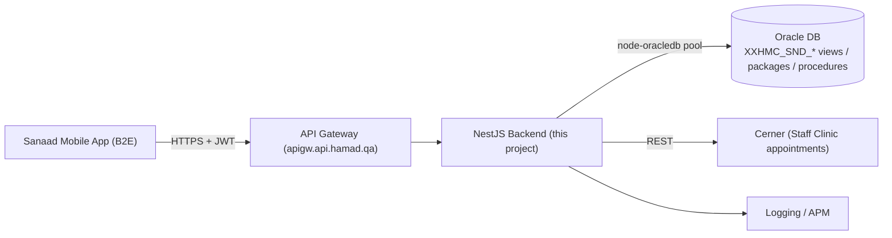
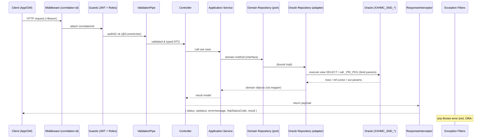

# Architecture — Target NestJS Backend (Sanaad B2E)

> Target architecture for the new NestJS backend that fronts the existing Oracle (Sanaad `XXHMC_SND_*`) objects. Reframed as a design blueprint because no code exists yet.

## 1. System context



The NestJS backend replaces the legacy **MobileFabric/Kony (Rhapsody)** service layer. It is an **orchestration + API layer**: it authenticates, validates, calls Oracle views/SPs (where business logic already lives), maps rows into the Sanaad response envelope, and handles i18n and errors.

## 2. NestJS building blocks (target usage)

| Block | Used for | Notes |
|---|---|---|
| **Modules** | 14 feature modules + `core`, `shared`, `lookups` | Feature-first; see Project Structure. |
| **Controllers** | HTTP routes per module | Thin; only validation + delegation + Swagger. |
| **Services (Application)** | Use-case orchestration | Compose repositories, map to envelope, no SQL. |
| **Repositories** | Oracle access ports + adapters | Interface in `domain`, impl in `infrastructure`. |
| **Entities / Value Objects** | Domain model | Framework-free; represent employee, leave request, dependent, etc. |
| **DTOs** | Request/response contracts | `class-validator` + `class-transformer`; Swagger models. |
| **Guards** | `JwtAuthGuard`, `RolesGuard` | Global JWT; `@Public()` opt-out; roles for approver ops (20–23, 68–71). |
| **Interceptors** | `ResponseInterceptor`, `LoggingInterceptor`, `TimeoutInterceptor` | Envelope shaping, structured logs, request timeout. |
| **Pipes** | Global `ValidationPipe` | `whitelist`, `transform`, `forbidNonWhitelisted`. |
| **Filters** | `AllExceptionsFilter`, `OracleExceptionFilter` | Map `ORA-#####` → HTTP + Sanaad error envelope. |
| **Middleware** | correlation-id, raw request logging | Before guards. |
| **Custom decorators** | `@CurrentUser()`, `@Roles()`, `@Public()`, `@Lang()` | Ergonomics for controllers. |
| **Providers / DI** | Token-based repo binding | `provide: <SYMBOL>` → `useClass: <Oracle impl>`. |
| **Configuration** | `@nestjs/config` | Validated env (DB DSN, pool size, JWT, gateway base). |
| **Background jobs / Queues** | Optional | Not required by current mapping; reserved for async submits (e.g., ticket/school-fee) if needed. |
| **Events** | In-process `EventEmitter2` | Domain events (e.g., `LeaveApplied`) for logging/notification hooks. |
| **WebSockets** | Not used | No realtime requirement in the mapping. |
| **External integrations** | Oracle (primary), **Cerner** (appointments 41–44) | Cerner via `masterlookup=Cerner*` + booking. |

## 3. Request lifecycle (Controller → Service → Repository → Oracle)



## 4. Response envelope (from the mapping samples)

All Sanaad responses share a consistent shape; the `ResponseInterceptor` standardizes success and the filters standardize failure:

```jsonc
// success
{ "result": { /* payload */ }, "opstatus": 0, "status": "success", "httpStatusCode": 200 }
// action (submit) success
{ "status": "success", "successflag": "S", "errormessage": "Success", "result": { } }
// failure (e.g. Oracle raised)
{ "status": "error", "opstatus": 1, "errormessage": "ORA-01403: no data found", "httpStatusCode": 400 }
```

## 5. Data access strategy (Oracle wrap)
- Single `node-oracledb` **connection pool** in `core/database/oracle.service.ts`.
- **Views** (`_V`, `_LOV`) → parameterized `SELECT`.
- **Procedures/packages** (`_PR`, `_PKG`) → `BEGIN pkg.proc(:in, :out); END;` with typed binds; ref-cursors read into arrays.
- Repositories return **domain objects**, never raw rows, via mappers.
- Business rules (validation, workflow) remain in Oracle; NestJS adds transport, authNZ, shaping, and i18n only. See `Docs Project/Repository Pattern/README.md`.

## 6. Cross-cutting concerns
- **AuthN/Z**: global `JwtAuthGuard` (bearer from gateway), `@Public()` for login (op 1, spec pending), `RolesGuard` for approver/supervisor operations.
- **i18n**: `lang` query (`en|ar`) resolved by `@Lang()`; Arabic fields are URL-encoded in Oracle output → decoded in mappers.
- **Errors**: `OracleExceptionFilter` maps common `ORA-` codes (e.g., `ORA-01403` no data → 404/empty) to the envelope.
- **Observability**: correlation-id middleware + `LoggingInterceptor` (method, path, duration, user, status).
- **Config**: all secrets/DSNs via `@nestjs/config`; nothing hard-coded.

## 7. Deployment shape (target)
- Stateless NestJS container(s) behind the existing API gateway; horizontal scaling.
- Oracle pool sized per instance; health/readiness endpoints (`/health`) checking pool + Oracle ping.
- Config via environment; secrets from vault/CI, never committed.

## Cross-references
- `Docs Project/Layers/README.md`, `Docs Project/Project Structure/README.md`, `Docs Project/Domains/README.md`, `Docs Project/API/README.md`.
