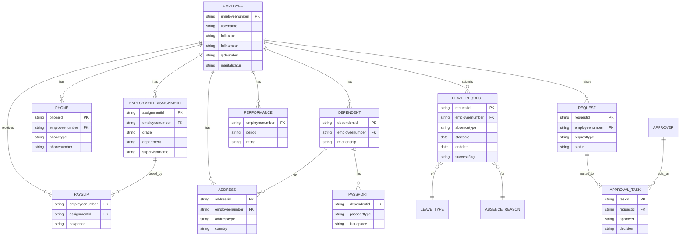
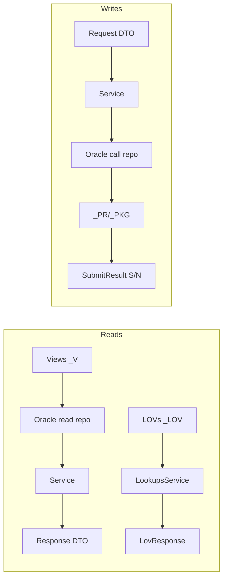

# Database — Oracle Data Contract (Sanaad `XXHMC_SND_*`)

> The new NestJS backend does **not** own a schema; it consumes the existing Oracle integration layer. This document catalogs the **87 `XXHMC_SND_*` objects** the backend calls (the "data contract"), classifies them, and presents a **conceptual ER model** of the HR entities those objects expose. Underlying base HR tables are not in the mapping and are therefore inferred/omitted.

## Object classification (from the mapping)

| Type | Count | Meaning | Access pattern |
|---|---|---|---|
| Views `_V` / `_VIEW` | 35 | Read models (employee, leave, approvals, LOV-like) | `SELECT … WHERE binds` |
| LOVs `_LOV` | 20 | List-of-values reference data | `SELECT` via `/data/lovlookup` registry |
| Procedures `_PR` | 22 | Transactional writes / calculations (business logic) | `BEGIN pkg?.proc(:binds); END;` |
| Packages `_PKG` | 2 | Grouped procedures (phone, dependent) | `BEGIN pkg.proc(:binds); END;` |
| Other (proc/func/table) | 8 | `CHK_PAYROLL_CNT`, `GET_PAYSLIP_PERIODS`, `PAYSLIP_PR`, `PASSPORT_TYPE`, `TICKET_MASTER`, `CHILD_DETL`, `EMP_LTR_DEFAULT_COPY`, `QID_CHG_PR` | mixed |

### Views (`_V`)
`ABSENCE_REASON_V`, `ABSENCE_TYPE_V`, `ACTION_HISTORY_V`, `APPROVE_SUMRY_V`, `BEREAV_RELAT_V`, `CHILD_DETS_VIEW`, `CONTRACT_YEAR_V`, `DELIVERY_LOC_V`, `DEP_PHONE_V`, `EMP_OUT_ADDRESS_V`, `EMP_PHONE_V`, `EMPLOYMENT_DETAILS_V`, `EXAM_CENTRE_V`, `LEAV_CLASS_V`, `LEAVE_AMEND_V`, `LEAVE_CANCEL_V`, `LEAVE_TYPE_V`, `MY_REQEST_SUMMARY_V`, `NOTYFY_APPR_V`, `NUM_OF_CHILD_V`, `PERFORMANCE_V`, `PERSONAL_DETAILS_V`, `PND_DEPENDENT_ADDR_V`, `PHONE_TYPE_V`, `PNDNG_QID_V`, `QID_DET_V`, `RFL_LEAVE_DET_V`, `RFL_REL_LEAVE1_V`, `RFL_REL_LEAVE2_V`, `SIT_DELEV_LOC_V`, `SIT_REASON_V`, `SIT_WORK_LOC_V`, `SUPERVISOR_VIEW`, `TEMP_ADD_TYPE_V`, `WORKLISTS_V`

### LOVs (`_LOV`)
`ACAD_YR_STRT_END_LOV`, `ALSR_DFALT_LOV`, `ANNUAL_TICKT_LOV`, `COUNTRY_LOV`, `DEP_LOOKUP_LOV`, `DEP_PLACE_LOV`, `EDU_STAGE_LOV`, `EMP_MARITAL_LOV`, `EXIT_COPIES_LOV`, `LEAVE_BAL_PLAN_LOV`, `LETTER_COUNTRY_LOV`, `LETTER_LANGUAGE_LOV`, `LETTER_MOBILE_NO_LOV`, `LETTER_NAME_LOV`, `LIBR_DFALT_LOV`, `REQUEST_TYPE_LOV`, `RFMI_USER_LOV`, `SCHOOL_NAME_LOV`, `SCHOOL_TERM_LOV`, `YES_NO_LOV`

### Procedures / Packages (`_PR`, `_PKG`) — business logic lives here
`ADD_DEPENDENT_PR`, `ADD_DEPENDENT_PKG`, `APPROVE_REJECT_PR`, `CALC_LEAV_DUR_PR`, `COID_REQ_PR`, `CREATE_ADDRESS_PR`, `DEL_PHONE_NUMBER_PR`, `HR_EMPLYMNT_LTR_PR`, `HR_LEAV_AMEND_PR`, `HR_LEAV_CANCEL_PR`, `LEAV_OF_ABSEN_NEW_PR`, `LEAVE_BALANCE_PR`, `PASS_DTL_PR`, `PAYSLIP_PR`, `PHONE_PKG` (`.ADD_OR_UPDATE_PHONE`), `QID_CHG_PR`, `REASSIGN_PR`, `REMOVE_DEPENDENT_PR`, `RET_FRM_LEAV_PR`, `SCHOOL_FEE_PR`, `SUPERVISOR_PR`, `TICKET_REQ_PR`, `UPD_ADDRESS_PR`, `UPD_PERSONAL_INFO_PR`, `UPDATE_DEPENDENT_PR`

## Full object → role → used-by map (selected/representative)

| Object | Type | Role | Used by op(s) |
|---|---|---|---|
| PERSONAL_DETAILS_V | View | Employee personal profile | 2, (auth me) |
| EMP_PHONE_V / DEP_PHONE_V | View | Employee/dependent phones | 2, 16 |
| EMP_OUT_ADDRESS_V / PND_DEPENDENT_ADDR_V / TEMP_ADD_TYPE_V | View | Addresses | 2 |
| EMPLOYMENT_DETAILS_V | View | Employment/assignment record | 3, 8, 45, 46 |
| GET_PAYSLIP_PERIODS | Proc/Fn | Payslip periods | 3, 5 |
| CHK_PAYROLL_CNT | Proc/Fn | Payslip count for month | 6 |
| PAYSLIP_PR | Proc | Generate payslip | 11 |
| PERFORMANCE_V | View | Appraisal records | 7 |
| LEAVE_BAL_PLAN_LOV + LEAVE_BALANCE_PR | LOV + Proc | Leave balances by plan | 9 |
| LEAV_OF_ABSEN_NEW_PR | Proc (~50 binds) | Apply leave | 10 |
| CALC_LEAV_DUR_PR | Proc | Leave duration calc | 47 |
| HR_LEAV_AMEND_PR / HR_LEAV_CANCEL_PR / RET_FRM_LEAV_PR | Proc | Amend/cancel/return | 57/58/56 |
| ABSENCE_TYPE_V / ABSENCE_REASON_V / LEAV_CLASS_V / LEAVE_TYPE_V | View | Leave reference | 12,13,14,46 |
| HR_EMPLYMNT_LTR_PR + LETTER_*_LOV | Proc + LOV | Employment letter request | 16, 17 |
| QID_DET_V / QID_CHG_PR / PNDNG_QID_V | View/Proc | QID details, change, pending | 18,19,20,21,23 |
| APPROVE_SUMRY_V / NOTYFY_APPR_V / APPROVE_REJECT_PR | View/Proc | Approvals summary/detail/decision | 20,21,22 |
| MY_REQEST_SUMMARY_V | View | My requests | 23 |
| WORKLISTS_V / ACTION_HISTORY_V / REASSIGN_PR | View/Proc | Worklist + reassign | 68,69,70,71 |
| PHONE_PKG / DEL_PHONE_NUMBER_PR / PHONE_TYPE_V | Pkg/Proc/View | Phone upsert/delete/type | 27,28,32 |
| CREATE_ADDRESS_PR / UPD_ADDRESS_PR / COUNTRY_LOV | Proc/LOV | Address create/update | 25,29,30 |
| ADD_DEPENDENT_PKG / ADD_DEPENDENT_PR / UPDATE_DEPENDENT_PR / REMOVE_DEPENDENT_PR / DEP_LOOKUP_LOV | Pkg/Proc/LOV | Dependent lifecycle | 24,31,64,65 |
| PASSPORT_TYPE / PASS_DTL_PR / DEP_PLACE_LOV | View/Proc/LOV | Passport | 33,34,49 |
| COID_REQ_PR / SIT_WORK_LOC_V / SIT_DELEV_LOC_V / SIT_REASON_V | Proc/View | Company/Staff ID card | 54,53b,59,60 |
| SCHOOL_FEE_PR + SCHOOL_*_LOV / EDU_STAGE_LOV / ACAD_YR_STRT_END_LOV / REQUEST_TYPE_LOV / CHILD_DETS_VIEW | Proc/LOV/View | School fees | 37,38,39,40,50,52,53 |
| TICKET_MASTER / TICKET_REQ_PR / ANNUAL_TICKT_LOV | View/Proc/LOV | Annual ticket | 66,67,45 |
| SUPERVISOR_VIEW / SUPERVISOR_PR | View/Proc | Supervisor view/update | 35,36 |
| UPD_PERSONAL_INFO_PR / EMP_MARITAL_LOV | Proc/LOV | Personal update, marital LOV | 48,63 |
| YES_NO_LOV / RFMI_USER_LOV | LOV | Shared lookups | 15,26 |

## Conceptual ER model (as exposed by the views)

> Inferred domain data model — not physical DDL. Keys shown are the join fields visible in the mapping samples (`employeenumber`, `assignmentid`, `dependentid`, `phoneid`, `addressid`).

## Data-flow (read vs write)

## Data characteristics & conventions
- **Keys:** `employeenumber` (a.k.a. `enum`/`personid`), `username` (e.g., `V-NFERNANDO`), `assignmentid`, `dependentid`, `phoneid`, `addressid`.
- **i18n:** paired columns `x` / `xar` (Arabic, **URL-encoded** in output) — decode in mappers.
- **Dates:** display strings like `18-Jun-2019`, `January 2024`, and tokens like `19000101` / `20200202`.
- **Write results:** `successflag` `S`/`N` + `errormessage` (+ `errormessagear`); some errors surface raw `ORA-#####`/`PLS-#####` — must be caught by `OracleExceptionFilter`, never returned raw.
- **Indexes/constraints/FKs:** not exposed by the mapping (they live on base HR tables); treat views as the contract.

## Recommendations
- Maintain a generated **object registry** (`shared/constants/oracle-objects.ts`) mirroring this catalog; single source for names.
- Add **read-only DB user** for view/LOV access and a separate grant profile for procedure execution.
- Capture actual **bind signatures** for each `_PR`/`_PKG` during implementation (only a few are fully shown in the mapping, e.g., `LEAV_OF_ABSEN_NEW_PR`, `PHONE_PKG.ADD_OR_UPDATE_PHONE`).

## Cross-references
`Docs Project/Repository Pattern/README.md`, `Docs Project/Domains/README.md`, `Docs Project/Legacy APIs/README.md`.
