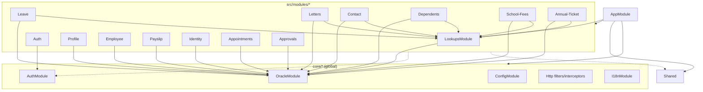

# Dependency Analysis — Target Module & Package Graph

> Target module dependency graph, shared-module strategy, external packages, and rules to avoid circular/unnecessary coupling for the new NestJS backend.

## Module dependency graph

**Rule:** feature modules depend only on `core/*`, `shared/*`, and `LookupsModule`. **Feature modules never import each other.** Anything shared between features goes to `shared/` or `lookups/`.

## Shared / global modules
- **`OracleModule`** — `@Global()`; exposes `OracleService` (the single pool). Every data-touching module uses it.
- **`ConfigModule`** — `@Global()`, validated env.
- **`AuthModule`** — exports guards + `@CurrentUser`; imported where route protection/roles differ.
- **`LookupsModule`** — generic LOV/master-lookup reader reused by leave, letters, contact, dependents, school-fees, annual-ticket, identity (each has domain-specific LOVs but all flow through the generic `/data/lovlookup` reader).
- **`shared/`** — DTO bases, constants (`oracle-objects.ts`, `lov-names.ts`), pure utils, interfaces. No providers with state.

## Coupling hotspots & how to avoid them
| Risk | Where | Mitigation |
|---|---|---|
| Many modules need LOVs | leave, letters, contact, dependents, school-fees, annual-ticket, identity | One `LookupsModule` with a generic reader keyed by `LOV_NAMES` constant → no feature-to-feature deps. |
| `XXHMC_SND_EMPLOYMENT_DETAILS_V` reused | employee (3,8), leave (45,46) | Expose a small `EmployeeContextService` from `employee` module **only via its public exports**, or read the view through a shared read model — do not import employee's Oracle repo from leave. |
| Approval + Worklist share `WORKLISTS_V`/QID views | approvals (20–23, 68–71) | Keep within a single `approvals` module (already grouped). |
| Cerner integration | appointments (41–44) | Isolate in `appointments/infrastructure/cerner.client.ts`; no other module depends on it. |

## Circular dependency policy
- Enforce with **`dependency-cruiser`** (or `eslint-plugin-import` `no-cycle`) in CI.
- If two features appear to need each other, extract the shared concept into `shared/` or a new small module — never use `forwardRef()` to paper over a design smell.
- Domain layer imports nothing outward, which structurally prevents most cycles.

## External packages (target `package.json`)

| Package | Purpose |
|---|---|
| `@nestjs/common`, `@nestjs/core`, `@nestjs/platform-express` | Framework |
| `@nestjs/config` | Env configuration |
| `@nestjs/swagger`, `swagger-ui-express` | OpenAPI from decorators |
| `@nestjs/jwt`, `passport`, `passport-jwt`, `@nestjs/passport` | Bearer/JWT auth |
| `oracledb` (node-oracledb) | Oracle connectivity (Thin mode) |
| `class-validator`, `class-transformer` | DTO validation/transform |
| `@nestjs/event-emitter` | In-process domain events (optional) |
| `nestjs-pino` / `pino` | Structured logging |
| `helmet`, `compression` | HTTP hardening/perf |
| `joi` or `zod` | Env schema validation |
| `axios` / `@nestjs/axios` | Cerner REST calls (appointments) |
| Dev: `jest`, `@nestjs/testing`, `supertest`, `dependency-cruiser`, `eslint`, `prettier` | Test/quality |

## Recommendations
- Publish a **module public API** (`index.ts` per module exporting only what others may use) to make coupling explicit.
- Add a CI job that renders this graph from code (`depcruise --output-type mermaid`) so the diagram stays truthful.
- Keep `oracledb` imported **only** inside `core/database` and `*/infrastructure/oracle` folders (lint rule).

## Cross-references
`Docs Project/Project Structure/README.md`, `Docs Project/Layers/README.md`, `Docs Project/Domains/README.md`.
