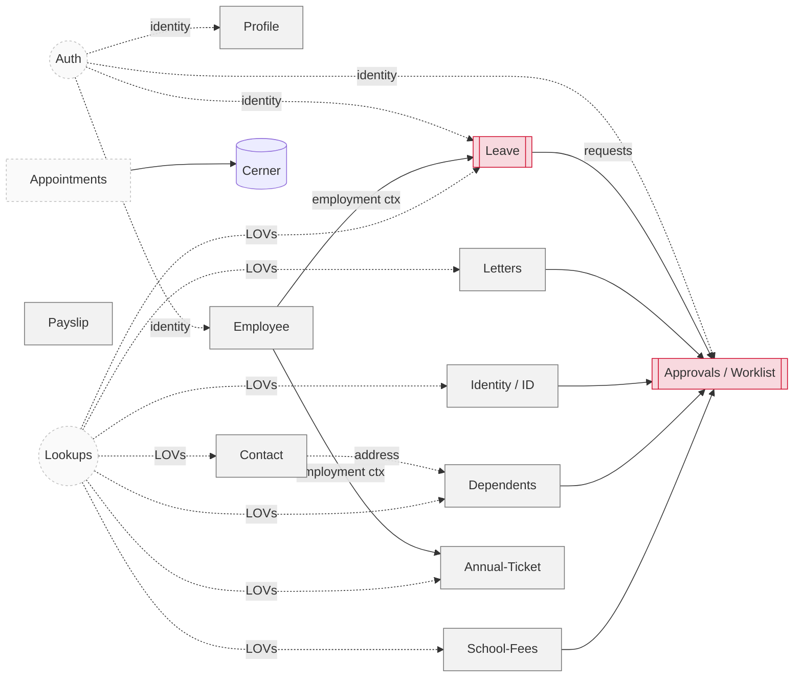

# Domain-Driven Design Analysis — Sanaad B2E

> Business domains derived from `sanaad-api-service-mapping.html` (71 operations, 87 Oracle objects). Reframed as **target DDD design** for the new NestJS backend wrapping Oracle. Because the transactional business logic lives in Oracle `_PR`/`_PKG` procedures, most write-side "domain services" are **thin coordinators over Oracle**; the domain model exists primarily to keep the app insulated and expressive (Supple Design), not to re-own the logic.

## Subdomain classification

| Type | Domains | Rationale |
|---|---|---|
| **Core** | Leave, Approvals/Worklist | Highest business value & complexity (apply/amend/cancel/return, multi-step approval). |
| **Supporting** | Profile, Employee, Payslip, Letters, Identity (QID/ID card), Contact, Dependents, School-Fees, Annual-Ticket | Employee self-service around HR data. |
| **Generic** | Auth, Lookups (LOV/master), Appointments (Cerner) | Solved patterns or external-owned (Cerner). |

## Context map

**Relationship patterns**
- **Approvals** is downstream of every request-producing domain (Leave, Letters, Identity, Dependents, School-Fees, Annual-Ticket) — it consumes a shared **Request/Approval** concept (`XXHMC_SND_MY_REQEST_SUMMARY_V`, `XXHMC_SND_APPROVE_SUMRY_V`, `XXHMC_SND_WORKLISTS_V`).
- **Employee** provides the **employment context** (assignment id, contract year) needed by Leave and Annual-Ticket — a **Customer/Supplier** relationship; publish a small read model rather than sharing repos.
- **Lookups** is a **Shared Kernel** (generic LOV reader) used by many domains.
- **Auth** provides identity to all (Conformist to the gateway's token).

## Shared kernel & cross-cutting
- **Value objects (shared):** `EmployeeNumber`, `Username`, `Lang(en|ar)`, `LocalizedText` (holds raw + decoded Arabic), `SubmitResult(successflag,status,errormessage)`, `LovItem(code,meaning,meaningAr)`, `DateToken` (e.g. `19000101`, `January 2024`).
- **Envelope** is an application/presentation concern (interceptor), **not** a domain concept.

## DDD adherence — where the design follows / must guard against violations
- **Follows:** clear bounded contexts, ubiquitous language taken from Oracle/operation names, repository ports per aggregate, shared kernel for LOVs.
- **Risk / anticorruption needed:**
  - Oracle field names (`enum`, `accurlpln`, `p_user_name`) and URL-encoded Arabic must be translated at the **infrastructure mapper** (Anticorruption Layer) — do not let them leak into domain/DTOs.
  - Cerner (Appointments) is an external model → wrap in an ACL client; never expose Cerner shapes.
  - Business logic is in Oracle: keep NestJS "domain services" as coordinators; **do not partially re-implement** Oracle rules (single source of truth) — document them as invariants instead.

---

## Domain catalog

Legend: **Agg** = aggregate root · **VO** = value object · **Port** = repository interface · **Impl** = Oracle adapter.

### 1. Auth `modules/auth` — op 1
- **Responsibilities:** authenticate employee, issue/verify bearer token, expose current identity.
- **Business rules:** login contract is **out-of-band** ("Another document provided") — treat as external IdP/gateway; validate JWT signature/expiry; map token → `EmployeeNumber`.
- **Agg/Entities:** `AuthenticatedUser` (identity). **VO:** `Username`, `EmployeeNumber`, `Roles`.
- **Domain svc:** token claims → user. **App svc:** `AuthService` (validate, `me`).
- **Port/Impl:** `UserContextRepository` (optional profile lookup) → Oracle `XXHMC_SND_PERSONAL_DETAILS_V`.
- **Events:** `UserAuthenticated`. **DTOs:** `LoginRequest?`, `TokenResponse?`, `MeResponse`.
- **Deps:** core/auth, Profile (read). **Open:** needs the auth spec doc.

### 2. Profile `modules/profile` — ops 2, 48, 63
- **Responsibilities:** view & update personal details; marital-status LOV.
- **Business rules:** update via `XXHMC_SND_UPD_PERSONAL_INFO_PR`; Arabic fields URL-encoded; marital status constrained to `EMP_MARITAL_LOV`.
- **Agg:** `EmployeePersonalProfile` (root) with phones, in/out addresses, dependents-phone. **Entities:** `EmployeePhone`, `EmployeeAddress`. **VO:** `LocalizedText`, `MaritalStatus`, `Country`.
- **Domain svc:** profile assembly. **App svc:** `ProfileService.getProfile / updatePersonal`, `MaritalStatusLovService`.
- **Port/Impl:** `ProfileRepository` → `XXHMC_SND_PERSONAL_DETAILS_V`, `EMP_PHONE_V`, `EMP_OUT_ADDRESS_V`, `TEMP_ADD_TYPE_V`, `DEP_PHONE_V`, `PND_DEPENDENT_ADDR_V`; `UPD_PERSONAL_INFO_PR`; `EMP_MARITAL_LOV`.
- **Events:** `PersonalDetailsUpdated`. **DTOs:** `ProfileResponse`, `UpdatePersonalRequest`, `LovResponse`.
- **Deps:** Lookups, Contact (addresses/phones overlap).

### 3. Employee `modules/employee` — ops 3, 7, 8, 35, 36
- **Responsibilities:** employment details, basic info, performance, supervisor view/update.
- **Business rules:** `basicinfo` and `service` both read `EMPLOYMENT_DETAILS_V`; supervisor update via `SUPERVISOR_PR`; performance from `PERFORMANCE_V`.
- **Agg:** `Employment` (root: assignment, grade, dept, supervisor). **Entities:** `PerformanceRecord`, `SupervisorView`. **VO:** `AssignmentId`, `Grade`, `Department(LocalizedText)`.
- **App svc:** `EmployeeService`, `SupervisorService`.
- **Port/Impl:** `EmploymentRepository` → `EMPLOYMENT_DETAILS_V`, `GET_PAYSLIP_PERIODS`, `PERFORMANCE_V`, `SUPERVISOR_VIEW`, `SUPERVISOR_PR`.
- **Events:** `SupervisorUpdated`. **Deps:** publishes **EmploymentContext** read model to Leave & Annual-Ticket.

### 4. Payslip `modules/payslip` — ops 5, 6, 11
- **Responsibilities:** list payslip periods, count for a month, generate/download payslip.
- **Business rules:** `payslipperiodcount` gates generation; payslip keyed by `payperiod` + `assignmentid`.
- **Agg:** `Payslip` (root). **Entities:** `PayslipPeriod`. **VO:** `PayPeriod` (`"January 2024"`), `AssignmentId`.
- **App svc:** `PayslipService.getPeriods/checkCount/generate`.
- **Port/Impl:** `PayslipRepository` → `GET_PAYSLIP_PERIODS`, `CHK_PAYROLL_CNT`, `PAYSLIP_PR`.
- **DTOs:** `PayslipPeriodResponse`, `PayslipCountResponse`, `PayslipResponse`. **Deps:** Employee (assignment).

### 5. Leave `modules/leave` — **Core** — ops 9,10,12,13,14,45,46,47,55,56,57,58,61,62
- **Responsibilities:** balances, apply/amend/cancel/return-from-leave, duration calculation, and all leave LOVs/defaults.
- **Business rules (invariants, enforced in Oracle):** balance by plan (`LEAVE_BAL_PLAN_LOV` + `LEAVE_BALANCE_PR`); apply via `LEAV_OF_ABSEN_NEW_PR`; duration via `CALC_LEAV_DUR_PR`; amend/cancel via `HR_LEAV_AMEND_PR`/`HR_LEAV_CANCEL_PR`; return via `RET_FRM_LEAV_PR`; type/reason/class from `ABSENCE_TYPE_V`/`ABSENCE_REASON_V`/`LEAV_CLASS_V`.
- **Agg:** `LeaveRequest` (root) → status lifecycle: Draft → Submitted → Approved/Rejected → Amended/Cancelled/Returned. **Entities:** `LeaveBalance`, `LeaveType`. **VO:** `LeavePeriod(start,end)`, `LeaveClass`, `AbsenceType`, `AbsenceReason`, `Duration`.
- **Domain svc:** `LeaveDurationPolicy` (delegates to Oracle calc), `LeaveEligibilityPolicy` (documented invariants).
- **App svc:** `LeaveService` with use cases: `GetBalance`, `Apply`, `Amend`, `Cancel`, `ReturnFromLeave`, `Calculate`, `GetLeaveDefaults`, `GetLeaveRequestLov`.
- **Port/Impl:** `LeaveBalanceRepository`, `LeaveApplyRepository`, `LeaveAmendRepository`, `LeaveCancelRepository`, `LeaveReturnRepository`, `LeaveCalcRepository`, `LeaveLovRepository` (ISP-sliced) → the corresponding `XXHMC_SND_*` objects.
- **Events:** `LeaveApplied`, `LeaveAmended`, `LeaveCancelled`, `ReturnedFromLeave`. **Deps:** Employee (context), Lookups; **produces requests to Approvals**.

### 6. Letters `modules/letters` — ops 16, 17
- **Responsibilities:** letter-request LOVs (mobile no, default copy, country, name, language, exit copies, delivery loc) and submit employment-letter request.
- **Business rules:** submit via `HR_EMPLYMNT_LTR_PR`; LOV bundle (op 16) fans out to 6 LOVs + phone → parallelize.
- **Agg:** `LetterRequest` (root). **VO:** `LetterType`, `LetterLanguage`, `DeliveryLocation`, `CopyCount`.
- **App svc:** `LettersService.getLetterLovs/submit`.
- **Port/Impl:** `LetterRepository` → `LETTER_*_LOV`, `EMP_LTR_DEFAULT_COPY`, `DELIVERY_LOC_V`, `HR_EMPLYMNT_LTR_PR`.
- **Events:** `LetterRequested`. **Deps:** Lookups, Contact (mobile no); **→ Approvals**.

### 7. Identity `modules/identity` — ops 18, 19, 53b, 54, 59, 60
- **Responsibilities:** QID details & update, company/staff ID card request, ID delivery location & reason, work-location LOV.
- **Business rules:** QID update via `QID_CHG_PR`; ID card via `COID_REQ_PR` (`/idcard/apply`); LOVs `SIT_WORK_LOC_LOV`, `SIT_DELEV_LOC_LOV`, `SIT_REASON_LOV`.
- **Agg:** `QatarId` (root) & `IdCardRequest` (root). **VO:** `Qid`, `WorkLocation`, `DeliveryLocation`, `IdReason`.
- **App svc:** `QidService`, `IdCardService`.
- **Port/Impl:** `QidRepository` → `QID_DET_V`, `QID_CHG_PR`; `IdCardRepository` → `COID_REQ_PR`, `SIT_*` LOVs.
- **Events:** `QidUpdated`, `IdCardRequested`. **Deps:** Lookups; **→ Approvals** (`PNDNG_QID_V`).

### 8. Contact `modules/contact` — ops 25, 27, 28, 29, 30, 32
- **Responsibilities:** phone create/update/delete, address create/update, phone-type & country LOVs.
- **Business rules:** phone ops via `PHONE_PKG` / `DEL_PHONE_NUMBER_PR`; address via `CREATE_ADDRESS_PR` / `UPD_ADDRESS_PR`; outside-country via `COUNTRY_LOV`.
- **Agg:** `ContactBook` (root) → `Phone`, `Address` entities. **VO:** `PhoneType`, `PhoneNumber`, `AddressType`, `Country`.
- **App svc:** `PhoneService`, `AddressService`.
- **Port/Impl:** `PhoneRepository` → `PHONE_PKG`, `DEL_PHONE_NUMBER_PR`, `PHONE_TYPE_V`; `AddressRepository` → `CREATE_ADDRESS_PR`, `UPD_ADDRESS_PR`, `COUNTRY_LOV`.
- **Events:** `PhoneChanged`, `AddressChanged`. **Deps:** Lookups; shared with Profile & Dependents (addresses).

### 9. Dependents `modules/dependents` — ops 24, 31, 33, 34, 49, 64, 65
- **Responsibilities:** add/update/delete dependents; passport type & detail request; passport issue place; dependent LOV.
- **Business rules:** add via `ADD_DEPENDENT_PKG`+`ADD_DEPENDENT_PR` (+`CREATE_ADDRESS_PR`); update `UPDATE_DEPENDENT_PR`; delete `REMOVE_DEPENDENT_PR`; passport `PASSPORT_TYPE`/`PASS_DTL_PR`; place `DEP_PLACE_LOV`.
- **Agg:** `Dependent` (root) → `Passport` entity, `DependentAddress`. **VO:** `Relationship`, `PassportType`, `IssuePlace`.
- **App svc:** `DependentService`, `PassportService`.
- **Port/Impl:** `DependentRepository` (add/update/remove), `PassportRepository` → the above objects + `DEP_LOOKUP_LOV`.
- **Events:** `DependentAdded/Updated/Removed`, `PassportRequested`. **Deps:** Contact (address), Lookups; **→ Approvals**.

### 10. School-Fees `modules/school-fees` — ops 37, 38, 39, 40, 50, 51*, 52, 53
- **Responsibilities:** school-fee request + supporting LOVs (school name/term, edu stage, academic year, request type, child details). *op 51 child-list **out of scope**.*
- **Business rules:** submit via `SCHOOL_FEE_PR`; children from `CHILD_DETS_VIEW`; academic year drives term/stage.
- **Agg:** `SchoolFeeRequest` (root) → `Child` entity. **VO:** `SchoolName`, `SchoolTerm`, `EduStage`, `AcademicYear`, `RequestType`.
- **App svc:** `SchoolFeeService` + LOV reads.
- **Port/Impl:** `SchoolFeeRepository` → `SCHOOL_FEE_PR`, `SCHOOL_NAME_LOV`, `SCHOOL_TERM_LOV`, `EDU_STAGE_LOV`, `ACAD_YR_STRT_END_LOV`, `REQUEST_TYPE_LOV`, `CHILD_DETS_VIEW`.
- **Events:** `SchoolFeeRequested`. **Deps:** Lookups, Dependents (children); **→ Approvals**.

### 11. Appointments `modules/appointments` — **Cerner ACL** — ops 41, 42, 43, 44
- **Responsibilities:** upcoming staff-clinic appointments, clinic master data, booking init, book appointment.
- **Business rules:** master data from `masterlookup=CernerClinics|CernerLocation|CernerMedicalServices`; **Book = validate + create combined**; screen-init aggregates masters + upcoming.
- **Agg:** `Appointment` (root). **VO:** `Clinic`, `ClinicLocation`, `MedicalService`, `AppointmentSlot`.
- **App svc:** `AppointmentsService.getUpcoming/getMasters/initBooking/book`.
- **Port/Impl:** `AppointmentsRepository` + `CernerClient` (ACL, `@nestjs/axios`). Not Oracle-backed.
- **Events:** `AppointmentBooked`. **Deps:** external Cerner only.

### 12. Annual-Ticket `modules/annual-ticket` — ops 66, 67
- **Responsibilities:** annual-ticket master LOV; submit ticket request.
- **Business rules:** submit via `TICKET_REQ_PR`; master `TICKET_MASTER`.
- **Agg:** `TicketRequest` (root). **VO:** `TicketClass`, `Destination`.
- **App svc:** `AnnualTicketService`.
- **Port/Impl:** `TicketRepository` → `TICKET_MASTER`, `TICKET_REQ_PR`.
- **Events:** `TicketRequested`. **Deps:** Employee (entitlement), Lookups; **→ Approvals**.

### 13. Approvals / Worklist `modules/approvals` — **Core** — ops 20, 21, 22, 23, 68, 69, 70, 71
- **Responsibilities:** approvals summary, approval detail view, approve/reject, my requests, worklist main/summary/action-history, reassign approval.
- **Business rules:** approver role required; approve/reject via `APPROVE_REJECT_PR`; reassign via `REASSIGN_PR`; QID approvals surfaced via `PNDNG_QID_V`.
- **Agg:** `ApprovalTask` (root) & `RequestSummary`. **Entities:** `WorklistItem`, `ActionHistoryEntry`. **VO:** `ApprovalDecision(APPROVE|REJECT)`, `Assignee`.
- **Domain svc:** `ApprovalRoutingPolicy` (documented; enforced in Oracle).
- **App svc:** `ApprovalsService`, `WorklistService`.
- **Port/Impl:** `ApprovalsRepository` → `APPROVE_SUMRY_V`, `NOTYFY_APPR_V`, `APPROVE_REJECT_PR`, `MY_REQEST_SUMMARY_V`, `PNDNG_QID_V`; `WorklistRepository` → `WORKLISTS_V`, `ACTION_HISTORY_V`, `REASSIGN_PR`.
- **Events:** `RequestApproved`, `RequestRejected`, `ApprovalReassigned`. **Deps:** consumes requests from Leave/Letters/Identity/Dependents/School-Fees/Annual-Ticket; requires `RolesGuard`.

### 14. Lookups (Shared Kernel) `lookups/` — ops 15, 26 + generic `/data/lovlookup`, `/data/masterlookup`
- **Responsibilities:** generic LOV & master-lookup reader for the whole app (Yes/No, RFMI user, and any `*_LOV`/`_V`).
- **Business rules:** resolve `lovname`/`lookupname` → Oracle object via a registry; `lang` filter.
- **Agg:** none (read-only). **VO:** `LovItem`, `LovName`, `LookupName`.
- **App svc:** `LookupsService.getLov/getMaster`.
- **Port/Impl:** `LovRepository` → generic parameterized read keyed by `LOV_OBJECT[name]` (registry incl. `YES_NO_LOV`, `RFMI_USER_LOV`, and all domain LOVs).
- **Deps:** none inbound (leaf); used by most domains (OCP-friendly registry).

## Recommendations
- Introduce a **Request/Approval shared kernel** VO set so all request-producing domains emit a consistent `SubmittableRequest` that Approvals can list uniformly.
- Enforce the **Anticorruption Layer** in mappers (Oracle/Cerner naming & Arabic decoding) — the top DDD risk here.
- Keep Oracle as the **single source of truth** for invariants; document them (as above) rather than duplicating in TS.

## Cross-references
`Docs Project/Repository Pattern/README.md`, `Docs Project/Services/README.md`, `Docs Project/API/README.md`, `Docs Project/Database/README.md`.
