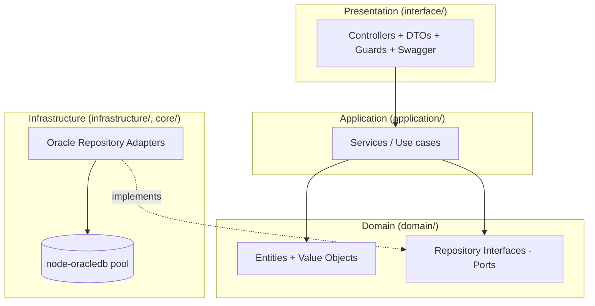

# Layered / Clean Architecture Review — Target Design

> No existing code, so this defines the **target** Clean Architecture the new NestJS backend must follow, plus the rules that keep it clean and the traps to avoid given the Oracle-wrap strategy.

## The four layers



**Dependency rule:** source dependencies point **inward** (Presentation → Application → Domain). Infrastructure depends on Domain (implements its ports) but Domain depends on nothing. This is enforced with DI tokens: services inject the **interface**, Nest binds the Oracle class.

## Layer responsibilities

| Layer | Contains | May depend on | Must NOT |
|---|---|---|---|
| **Presentation** | Controllers, request/response DTOs, validation, guards, interceptors, Swagger | Application services, shared DTOs | Contain business rules, touch Oracle, build SQL |
| **Application** | Use cases/services, orchestration, transaction boundaries, mapping to envelope | Domain (entities + ports) | Import `@nestjs/*` HTTP types, import Oracle driver, know SQL |
| **Domain** | Entities, value objects, repository **interfaces**, domain events | Nothing (pure TS) | Import NestJS, oracledb, DTOs, or any framework |
| **Infrastructure** | Oracle repository impls, mappers, `OracleService` pool, config, external clients (Cerner) | Domain ports, core/config | Leak Oracle row shapes upward; contain use-case logic |

## Where Oracle fits
Because business logic lives in Oracle (`_PR`/`_PKG`), the **Infrastructure** layer is deliberately "fat at the boundary but thin in code": adapters translate a domain call into a bind-and-execute against a specific `XXHMC_SND_*` object and map results back. The Domain still models the concepts (LeaveRequest, Dependent, Payslip) so the rest of the app is insulated from Oracle naming and could later swap the data source.

## Example flow across layers (Apply Leave, op 10)

```text
POST /api/v1/leave/apply
  Presentation:  LeaveController.apply(@Body ApplyLeaveRequestDto, @CurrentUser u)
  Application:   LeaveService.apply(cmd)  -> builds ApplyLeaveCommand
  Domain:        LeaveRepository.apply(leaveRequest: LeaveRequest): Promise<SubmitResult>
  Infrastructure:LeaveOracleRepository -> call XXHMC_SND_LEAV_OF_ABSEN_NEW_PR(:p_user_name, ...)
                 mapper -> SubmitResult(successflag,'S', errormessage)
  Presentation:  ResponseInterceptor -> Sanaad envelope
```

## Common violations to prevent (checklist)
- **Business logic in controllers** — controllers must only validate + delegate.
- **Oracle types leaking upward** — never return `oracledb` rows/`Result` from a service; map to domain/DTO in the adapter.
- **Domain importing framework** — no `@Injectable()`/`@nestjs/*`/`oracledb` in `domain/` (entities/ports are plain TS; ports are `interface`/abstract class tokens).
- **Skipping the port** — services must inject `LEAVE_REPOSITORY` (token), not `LeaveOracleRepository` directly.
- **Cross-module domain reuse via infrastructure** — share through `shared/` or explicit module exports, not by importing another module's Oracle repo.
- **Envelope building scattered** — centralize in `ResponseInterceptor`/filters, not per-controller.

## Recommendations
- Add an **ArchUnit-style lint** (e.g., `eslint-plugin-boundaries` or `dependency-cruiser`) to fail CI when the dependency rule is broken.
- Keep **mappers** pure and unit-tested (Oracle row ↔ domain) — highest-value tests in an Oracle-wrap design.
- Model **submit results** and **LOV items** as shared value objects to avoid duplicating the envelope logic across 40+ read/lookup ops.

## Cross-references
`Docs Project/Architecture/README.md`, `Docs Project/Repository Pattern/README.md`, `Docs Project/SOLID Review/README.md`, `Docs Project/Dependencies/README.md`.
