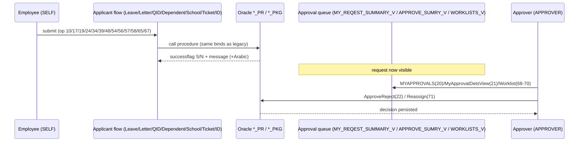

# Legacy API Mapping — Migration Blueprint

> **Source of truth: `Docs Project/sanaad-api-service-mapping.html` (v1.9).** For every legacy Sanaad operation this maps: business purpose → target NestJS module/controller/service/repository/DTOs/entities → Oracle objects → auth/authorization → related workflow. Goal: rebuild/migrate the APIs in NestJS **while preserving existing behavior** (business logic remains in the Oracle `_PR`/`_PKG` objects).

## How to read this
- **Legacy layer:** MobileFabric/Kony (Rhapsody) service → REST on `https://apigw{,uat}.api.hamad.qa/sanaad` → Oracle `XXHMC_SND_*`.
- **Target layer:** NestJS controller (`/api/v1/...`) → application service → domain repository port → Oracle adapter (same object).
- **Auth:** `Bearer` = authenticated employee (`@CurrentUser`); **Role** column: `SELF` (own data), `APPROVER`/`SUPERVISOR` (delegated).
- `*` = method/route inferred (source lacked an explicit badge); confirm at build time.
- **Preserve-behavior rule:** the target adapter must call the **same Oracle object with the same params**; NestJS only re-implements transport, validation, i18n, and shaping.

## Master migration table

| # | Legacy op / WS function | Legacy endpoint | Oracle object(s) | Target module → service.method | Role | Workflow |
|---|---|---|---|---|---|---|
| 1 | Login | (out-of-band) | — | auth → `AuthService.login` | Public | Auth |
| 2 | PersonalDets / GetPersonalDetails | `GET /empprsnlinfo` · `GET /employee/profile` | PERSONAL_DETAILS_V, EMP_PHONE_V, EMP_OUT_ADDRESS_V, TEMP_ADD_TYPE_V, DEP_PHONE_V, PND_DEPENDENT_ADDR_V, COUNTRY_LOV | profile → `ProfileService.get` | SELF | Profile view |
| 3 | EMPDETS / GetEmploymentDetails | `GET /employee/service` | EMPLOYMENT_DETAILS_V, GET_PAYSLIP_PERIODS | employee → `EmployeeService.employment` | SELF | Employment view |
| 5 | GET_PAYSLIP_PERIOD | `GET /employee/payslipperiod` | GET_PAYSLIP_PERIODS | payslip → `PayslipService.getPeriods` | SELF | Payslip |
| 6 | CHECK_PAYSLIP_COUNT | `GET /employee/payslipperiodcount` | CHK_PAYROLL_CNT | payslip → `PayslipService.checkCount` | SELF | Payslip (gate) |
| 7 | GETPERFORMANCE | `GET /employee/performance` | PERFORMANCE_V | employee → `EmployeeService.performance` | SELF | Performance view |
| 8 | GET_BASIC_EMP | `GET /employee/basicinfo` | EMPLOYMENT_DETAILS_V | employee → `EmployeeService.basic` | SELF | Employment view |
| 9 | Leave balance | `GET /employee/leave/info` | LEAVE_BAL_PLAN_LOV, LEAVE_BALANCE_PR | leave → `GetLeaveBalanceUseCase` | SELF | Leave |
| 10 | Leave Submission | `POST /employee/leave/apply` | LEAV_OF_ABSEN_NEW_PR | leave → `ApplyLeaveUseCase.apply` | SELF | **Leave apply → Approval** |
| 11 | Generate Payslip | `GET /employee/payslip` | PAYSLIP_PR | payslip → `PayslipService.generate` | SELF | Payslip |
| 12 | GetLeaveType | `GET /data/masterlookup?lookupname=GetLeaveType` | ABSENCE_TYPE_V | leave → `LeaveLovService.types` | SELF | Leave (ref) |
| 13 | GetLeaveReasonType | `GET /data/masterlookup` | ABSENCE_REASON_V | leave → `LeaveLovService.reasons` | SELF | Leave (ref) |
| 14 | GetLeaveclassType | `GET /data/masterlookup` | LEAV_CLASS_V | leave → `LeaveLovService.classes` | SELF | Leave (ref) |
| 15 | GetYesno | `GET /data/masterlookup` | YES_NO_LOV | lookups → `LookupsService.yesNo` | SELF | Shared |
| 16 | LetterReqLOV | `GET /employee/phone` + 6× `/data/lovlookup` | LETTER_MOBILE_NO_LOV, EMP_LTR_DEFAULT_COPY, LETTER_COUNTRY_LOV, LETTER_NAME_LOV, LETTER_LANGUAGE_LOV, EXIT_COPIES_LOV, DELIVERY_LOC_V | letters → `LettersService.getLetterLovs` | SELF | Letters (init) |
| 17 | LetterReqSubmit | `POST /employee/letter/apply`* | HR_EMPLYMNT_LTR_PR | letters → `LettersService.submit` | SELF | **Letter → Approval** |
| 18 | GET_QID_DET | `GET`* | QID_DET_V | identity → `QidService.getQid` | SELF | QID |
| 19 | QID_UPD_PR | `POST`* | QID_CHG_PR | identity → `QidService.updateQid` | SELF | **QID → Approval** |
| 20 | MYAPPROVALS | `GET`* | APPROVE_SUMRY_V, PNDNG_QID_V | approvals → `ApprovalsService.summary` | APPROVER | Approvals |
| 21 | MyApprovatDetsView | `GET`* | NOTYFY_APPR_V, PNDNG_QID_V | approvals → `ApprovalsService.details` | APPROVER | Approvals |
| 22 | ApproveReject | `POST`* | APPROVE_REJECT_PR | approvals → `ApprovalsService.decision` | APPROVER | **Approval decision** |
| 23 | MYREQUESTS | `GET /supervisor/requests` | MY_REQEST_SUMMARY_V, PNDNG_QID_V | approvals → `ApprovalsService.myRequests` | SELF | Requests |
| 24 | UPDATE_DEPENDENT_PR | `POST`* | ADD_DEPENDENT_PKG, UPDATE_DEPENDENT_PR | dependents → `DependentService.update` | SELF | **Dependent → Approval** |
| 25 | UPDATE_ADDRESS_SUBMIT | `POST`* | UPD_ADDRESS_PR | contact → `AddressService.update` | SELF | Contact |
| 26 | RFMI_USER_LOV | `GET`* | RFMI_USER_LOV | lookups → `LookupsService.rfmiUser` | SELF | Shared |
| 27 | PhoneTypeLOV | `GET /data/lovlookup?Lovname=PHONE_TYPE_LOV` | PHONE_TYPE_V | contact → `PhoneService.phoneTypeLov` | SELF | Contact (ref) |
| 28 | UPDATE_PHONE_NUMBER / update_phone_pr | `POST /employee/phone/update` | PHONE_PKG.ADD_OR_UPDATE_PHONE | contact → `PhoneService.upsertPhone` | SELF | Contact |
| 29 | CREATE_ADDRESS_SUBMIT | `POST`* | CREATE_ADDRESS_PR | contact → `AddressService.createAddress` | SELF | Contact |
| 30 | UpdateAddress_OutsideCountry_LOV | `GET /data/lovlookup?Lovname=COUNTRY_LOV` | COUNTRY_LOV | contact → `AddressService.countryLov` | SELF | Contact (ref) |
| 31 | DELETE_DEPENDENT_PR | `POST /employee/dependent/delete` | REMOVE_DEPENDENT_PR | dependents → `DependentService.delete` | SELF | Dependent |
| 32 | DELETE_PHONE_DETAILS_SUBMIT_PR | `POST`* | DEL_PHONE_NUMBER_PR | contact → `PhoneService.deletePhone` | SELF | Contact |
| 33 | GET_PP_TYPE | `GET /employee/passport/type` | PASSPORT_TYPE | dependents → `PassportService.passportTypes` | SELF | Passport (ref) |
| 34 | PASSPORT_DET_REQ_PR | `POST`* | PASS_DTL_PR | dependents → `PassportService.passportApply` | SELF | **Passport → Approval** |
| 35 | GET_SUPERVISOR_VIEW | `GET /supervisor/views` | SUPERVISOR_VIEW | employee → `SupervisorService.views` | SUPERVISOR | Supervisor |
| 36 | SUPERVISOR_PR | `POST`* | SUPERVISOR_PR | employee → `SupervisorService.update` | SUPERVISOR | Supervisor |
| 37 | GET_SCH_FEE_SCHOOL_NAME | `GET /data/lovlookup?Lovname=SCHOOL_NAME_LOV` | SCHOOL_NAME_LOV | school-fees → `SchoolFeeService.schoolsLov` | SELF | School fees (ref) |
| 38 | GET_SCH_FEE_SCHOOL_TERM | `GET /data/lovlookup?Lovname=SCHOOL_TERM_LOV` | SCHOOL_TERM_LOV | school-fees → `SchoolFeeService.termsLov` | SELF | School fees (ref) |
| 39 | SCHOOL_FEE_REQ_PR | `POST`* | SCHOOL_FEE_PR | school-fees → `SchoolFeeService.apply` | SELF | **School fee → Approval** |
| 40 | GET_SCH_FEE_EDU_STAGE | `GET /data/lovlookup?Lovname=EDU_STAGE_LOV` | EDU_STAGE_LOV | school-fees → `SchoolFeeService.eduStageLov` | SELF | School fees (ref) |
| 41 | Get Upcoming Staff Clinic Appointments | `GET /employee/appointments` | Cerner | appointments → `AppointmentsService.getUpcoming` | SELF | Appointments |
| 42 | Get Staff Clinic Master Details | `GET /data/masterlookup?lookupname=Cerner*` | Cerner | appointments → `AppointmentsService.getMasters` | SELF | Appointments (ref) |
| 43 | Booking Screen Init | `GET`* | Cerner (aggregate) | appointments → `AppointmentsService.initBooking` | SELF | Appointments |
| 44 | Book Appointment (Validate+Create) | `POST`* | Cerner | appointments → `AppointmentsService.book` | SELF | **Appointment booking** |
| 45 | GetLeaveDefault_LOV | `GET`* | EMPLOYMENT_DETAILS_V, ANNUAL_TICKT_LOV, LIBR_DFALT_LOV, ALSR_DFALT_LOV, CONTRACT_YEAR_V | leave → `LeaveLovService.getDefaults` | SELF | Leave (init) |
| 46 | GetLeaveRequestLOV | `GET /data/lovlookup?Lovname=NUM_OF_CHILD_LOV` (+several) | NUM_OF_CHILD_V, LEAV_CLASS_V, EXAM_CENTRE_V, BEREAV_RELAT_V, CONTRACT_YEAR_V, ABSENCE_TYPE_V, ABSENCE_REASON_V, LEAVE_TYPE_V, EMPLOYMENT_DETAILS_V | leave → `LeaveLovService.getRequestLov` | SELF | Leave (init) |
| 47 | LEAVE_CALCULATION | `POST`* | CALC_LEAV_DUR_PR | leave → `CalculateLeaveUseCase` | SELF | Leave (calc) |
| 48 | PersonalDetsUpdate | `POST`* | UPD_PERSONAL_INFO_PR | profile → `ProfileService.updatePersonal` | SELF | **Profile → Approval** |
| 49 | GetPassportIssuePlace | `GET /data/lovlookup?Lovname=DEP_PLACE_LOV` | DEP_PLACE_LOV | dependents → `PassportService.issuePlaceLov` | SELF | Passport (ref) |
| 50 | GET_SCH_FEE_ACADEMIC_YEAR | `GET /data/lovlookup?Lovname=ACAD_YR_STRT_END_LOV` | ACAD_YR_STRT_END_LOV | school-fees → `SchoolFeeService.academicYearLov` | SELF | School fees (ref) |
| 51 | GET_SCH_FEE_CHILD_LIST | — **Not in scope** | CHILD_DETL | (school-fees) | — | — |
| 52 | GET_SCH_FEE_CHILD_DTLS | `GET /employee/school/children` | CHILD_DETS_VIEW | school-fees → `SchoolFeeService.children` | SELF | School fees |
| 53 | GET_SCH_FEE_REQUEST_TYPE | `GET /data/lovlookup?Lovname=REQUEST_TYPE_LOV` | REQUEST_TYPE_LOV | school-fees → `SchoolFeeService.requestTypeLov` | SELF | School fees (ref) |
| 53b | GET_HMC_ID_WORK_LOC | `GET /data/lovlookup?Lovname=SIT_WORK_LOC_LOV` | SIT_WORK_LOC_V | identity → `IdCardService.workLocLov` | SELF | ID card (ref) |
| 54 | RequestCompanyID | `POST /employee/idcard/apply` | COID_REQ_PR | identity → `IdCardService.requestCompanyId` | SELF | **ID card → Approval** |
| 55 | ReturnFromLeaveLOV | `GET /data/lovlookup?Lovname=RFL_REL_LEAVE1_LOV` | RFL_REL_LEAVE1_V, RFL_REL_LEAVE2_V, RFL_LEAVE_DET_V | leave → `LeaveLovService.returnLov` | SELF | Return-from-leave (init) |
| 56 | ReturnFromLeaveSubmit | `POST`* | RET_FRM_LEAV_PR | leave → `ReturnFromLeaveUseCase` | SELF | **Return → Approval** |
| 57 | LEAVEAMEND | `POST`* | HR_LEAV_AMEND_PR, RET_FRM_LEAV_PR | leave → `AmendLeaveUseCase` | SELF | **Amend → Approval** |
| 58 | LEAVECANCEL | `POST`* | HR_LEAV_CANCEL_PR, RET_FRM_LEAV_PR | leave → `CancelLeaveUseCase` | SELF | **Cancel → Approval** |
| 59 | IDdeliverylocation | `GET /data/lovlookup?Lovname=SIT_DELEV_LOC_LOV` | SIT_DELEV_LOC_V | identity → `IdCardService.deliveryLov` | SELF | ID card (ref) |
| 60 | IDReason | `GET /data/lovlookup?Lovname=SIT_REASON_LOV` | SIT_REASON_V | identity → `IdCardService.reasonLov` | SELF | ID card (ref) |
| 61 | LeaveCancelLOV | `GET`* | LEAVE_CANCEL_V | leave → `LeaveLovService.cancelLov` | SELF | Cancel (init) |
| 62 | LeaveAmendLOV | `GET /data/lovlookup?Lovname=LEAVE_TO_AMEND_LOV` | LEAVE_AMEND_V | leave → `LeaveLovService.amendLov` | SELF | Amend (init) |
| 63 | MaritalStatusLOV | `GET /data/lovlookup?Lovname=EMP_MARITAL_LOV` | EMP_MARITAL_LOV | profile → `ProfileService.maritalStatusLov` | SELF | Profile (ref) |
| 64 | DependentLOV | `GET /data/lovlookup?Lovname=DEP_LOOKUP_LOV` | DEP_LOOKUP_LOV | dependents → `DependentService.dependentLov` | SELF | Dependent (ref) |
| 65 | ADD_DEPENDENT_PR | `POST`* | ADD_DEPENDENT_PKG, ADD_DEPENDENT_PR, CREATE_ADDRESS_PR | dependents → `DependentService.add` | SELF | **Add dependent (+address) → Approval** |
| 66 | AnnualticketmasterLOV | `GET`* | TICKET_MASTER | annual-ticket → `AnnualTicketService.master` | SELF | Annual ticket (ref) |
| 67 | Submit_Annual_Ticket | `POST`* | TICKET_REQ_PR | annual-ticket → `AnnualTicketService.apply` | SELF | **Ticket → Approval** |
| 68 | WorklistMain | `GET`* | WORKLISTS_V | approvals → `WorklistService.worklist` | APPROVER | Worklist |
| 69 | Worklistsummary | `GET`* | WORKLISTS_V | approvals → `WorklistService.worklistSummary` | APPROVER | Worklist |
| 70 | Worklistactionhistory | `GET`* | ACTION_HISTORY_V | approvals → `WorklistService.history` | APPROVER | Worklist |
| 71 | Reassignapproval | `POST`* | REASSIGN_PR | approvals → `WorklistService.reassign` | APPROVER | **Reassign** |

## Key business workflows (to preserve on migration)

### Request → Approval (the central pattern)
Most write operations create a request that enters an approval queue. Preserve this end-to-end:

**Note:** Leave apply may reject with *"A Request is pending for approval…"* — preserve this guard message and `successflag=N` semantics.

### Leave lifecycle
`GetLeaveDefault_LOV(45)`/`GetLeaveRequestLOV(46)` → `LEAVE_CALCULATION(47)` → `Leave apply(10)`; later `Amend(57)`, `Cancel(58)`, `ReturnFromLeave(56)`, each with its own LOV init (`62`, `61`, `55`). All flow to Approvals.

### Dependent add composes address
`ADD_DEPENDENT_PR(65)` invokes `ADD_DEPENDENT_PKG` **and** `CREATE_ADDRESS_PR` — the target `DependentService.add` must orchestrate the address creation (reuse `AddressService`) exactly as the legacy package does.

### Letters init fan-out
`LetterReqLOV(16)` aggregates phone + 6 LOVs in one call — implement as parallel reads and return a single composite DTO.

### Appointments (external)
`41–44` are **Cerner**-backed (not Oracle). Wrap in an Anticorruption client; `Book(44)` is validate+create combined — preserve the single-call contract.

## Migration guardrails
- **Same Oracle object + same params** per operation (columns above) — do not "optimize" procedure calls.
- Preserve the **response envelope** and **`successflag` S/N** semantics and Arabic `errormessagear` (URL-encoded).
- Preserve **empty-result** behavior (`ORA-01403 no data found` → empty, not error).
- Confirm the `*`-inferred methods/paths against the live gateway before cutover.
- Keep **legacy paths** available via a compatibility layer if the mobile app cannot switch to `/api/v1` immediately.

## Cross-references
`Docs Project/API/README.md` (target routes), `Docs Project/Database/README.md` (Oracle objects), `Docs Project/Domains/README.md` (bounded contexts), `Docs Project/Postman/` (examples).
